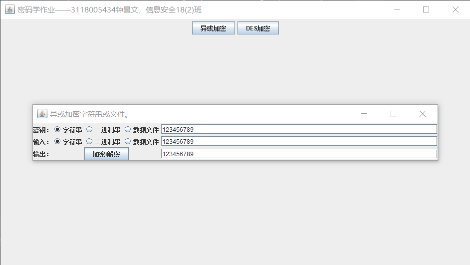
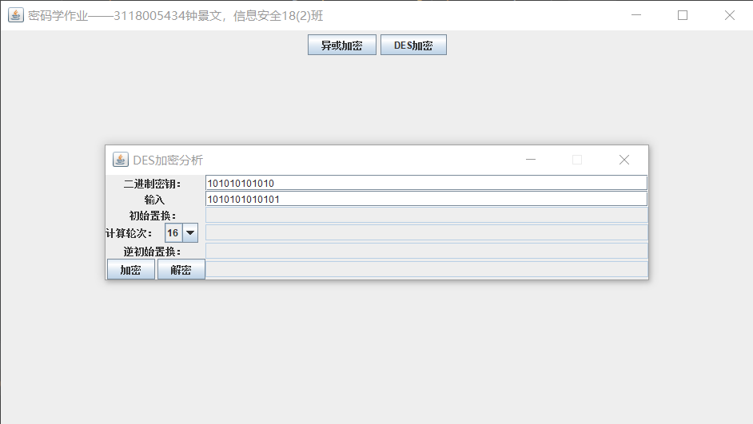
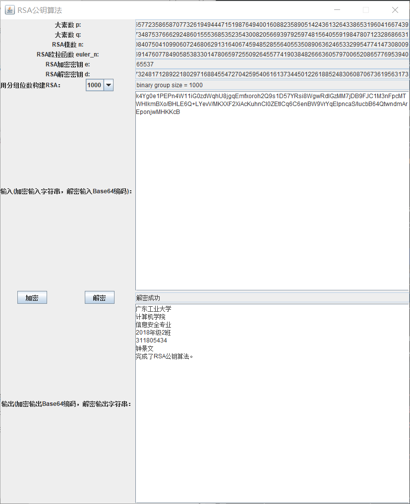
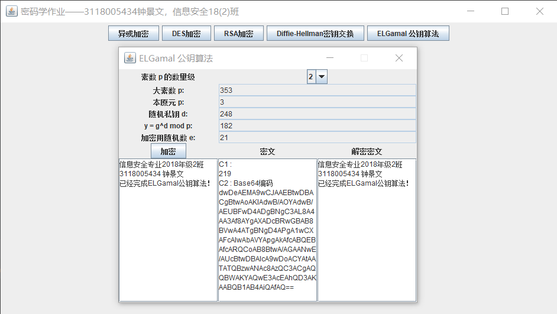
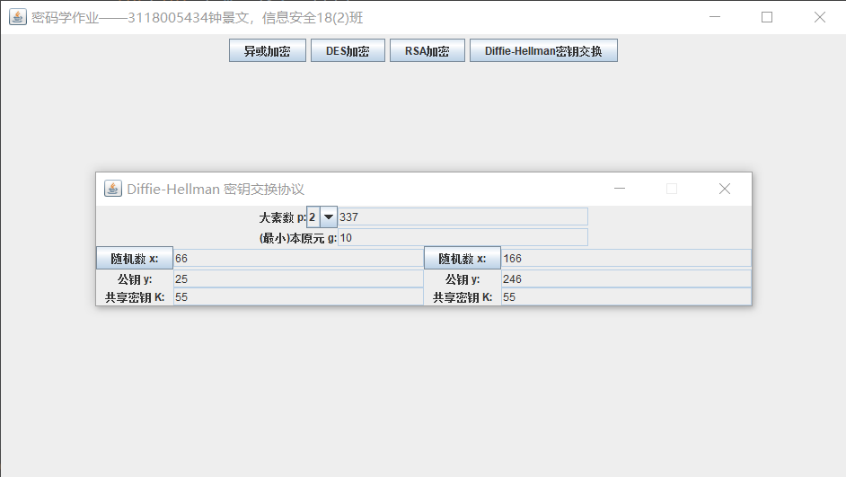
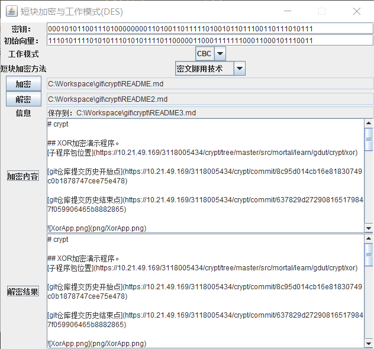

# crypt

## XOR加密演示程序。
[子程序包位置](https://10.21.49.169/3118005434/crypt/tree/master/src/mortal/learn/gdut/crypt/xor)  

[git仓库提交历史开始点](https://10.21.49.169/3118005434/crypt/commit/8c95d014cb16e81830749c0b1878747cee75e478)  

[git仓库提交历史结束点](https://10.21.49.169/3118005434/crypt/commit/637829d272908165179847f059906465b8882865)

  

## DES加密分析程序。
[子程序包位置](https://10.21.49.169/3118005434/crypt/tree/master/src/mortal/learn/gdut/crypt/des)  

[git仓库提交历史开始点](https://10.21.49.169/3118005434/crypt/commit/fe3ef98587b1b5686482c3ce5d15ba74bee89eef)  

[git仓库提交历史结束点](https://10.21.49.169/3118005434/crypt/commit/53e7b0ead8fc88f0a4938e98be141466ccc59589)
  

## RSA公钥算法分析程序。
[子程序包位置](https://10.21.49.169/3118005434/crypt/tree/master/src/mortal/learn/gdut/crypt/rsa)  
[git仓库提交历史开始点](https://10.21.49.169/3118005434/crypt/commit/c4ceec9161a1cbe167de5b67091de965bf204dee)  
[git仓库提交历史结束点](https://10.21.49.169/3118005434/crypt/commit/8d20c2a621ede731f22893aa55397fd77d3b007a)  
**注意**：该程序并非只能加密字符串，只是为了演示方便才只使用字符串来演示。
  

## ELGamal公钥算法分析
[子程序包位置](https://10.21.49.169/3118005434/crypt/tree/master/src/mortal/learn/gdut/crypt/elgamal)  
[git仓库提交历史开始点](https://10.21.49.169/3118005434/crypt/commit/a7d99377b65e89c1640125ea6a7cd4449f97591f)  
[git仓库提交历史结束点](https://10.21.49.169/3118005434/crypt/commit/73a46c2f45d7324e0caa4b77fee439f8e71df3dc)  
  

## Diffie-Hellman 密钥交换协议  
[子程序包位置](https://10.21.49.169/3118005434/crypt/tree/master/src/mortal/learn/gdut/crypt/dh)  
[git仓库提交历史开始点](https://10.21.49.169/3118005434/crypt/commit/645b8073ffe3a471107fdfa299468fa3aa107c13)  
[git仓库提交历史结束点](https://10.21.49.169/3118005434/crypt/commit/789839f44667708b8d8039479b3f0f5c6650427a)  
  

## 短块加密与工作模式(DES)
[子程序包位置](https://10.21.49.169/3118005434/crypt/tree/master/src/mortal/learn/gdut/crypt/blockcipher)  
[git仓库提交历史开始点](https://10.21.49.169/3118005434/crypt/commit/20b97671c4ac9cbd0b1b3dec628d707f54e0aaba)  
[git仓库提交历史结束点](https://10.21.49.169/3118005434/crypt/commit/10b199f942e420d754efd77a795e7ef9d97dffd8)  
  
